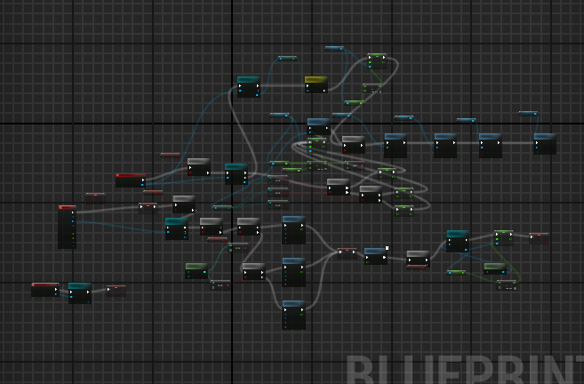

# Candidate 571
# Highlight of contributions to the game

I have been the leader of the team. I have been responsible for characters animations (Animation instance implementation), health bars, AI/NPC-s, combat and I have worked a little on the HUD. 

I have been doing a udemy course to help with programming this game. I have been working through *Unreal Engine 5 C++ The Ultimate Game Developer Course* by Stephen Ulibarri, to be exact. I have now completed 50 \% of the course. [The Ultimate Game Developer Course](https://www.udemy.com/course/unreal-engine-5-the-ultimate-game-developer-course/learn/lecture/33116840?start=720), see figure 1.

In Stephen's course, a lot of information about programming Unreal in C++ is covered, especially when it comes to animations. This is why it felt natural to apply myself in this way to this project.  In Unreal, it helps to be able to program to get the most out of the animation blueprints system as you can create your own animation instance implementation, and expose aspects of the internals of the game to the animation system. See the uml, UAnimInstance.

I implemented how Harker, the player character, strafes, runs, and can switch to crossbow. I implemented animation montages to let him swing his crossbow and fight enemies. I also implemented the animations for the enemies, which was a lot simpler. They can't strafe and mainly run, idle, attack and die. Attacking and dying is done with animation montages. Without Stephen's course, it would have been impossible for me to figure out how to make the characters animate inside Unreal. It was a pleasure doing Programming II, especially with the structure and help from the online course I did.

I have tried to implement everything covered in class. Per-Kristian showed us interfaces, that is the only thing shown in class which I did not implement into the game. Also, I use Blueprints for saving and loading the high score in survival mode. Some things seem a lot simpler in Blueprints.

I have also implemented combat. It was at first done in Blueprints. See figure 2. This made it easy and fast to implement, but it was really janky. Enemies would only attack when the player went into their hitbox, which resulted in enemies sometimes standing right infront of the player doing nothing, other times doing too many attack in a row. The system was ported over to C++ and works now really well.

Almost all the code is done in C++. Combat, animation instances, all sorts of stuff is done in C++ and it has been great fun.

# Self-reflection, what went well, what would you do differently.

I personally felt like this project went remarkably well without too much upset. There were many team members who were absent a lot, which is something I would like to somehow prevent in the future. I'm not sure what caused this. I was very stressed at the beginning of the project. I think the stress and worry propelled me into working quite hard and delivering something on par with the other groups.

You can find the Github repository for the game here: [https://github.com/alanhaugen/Programming-II](https://github.com/alanhaugen/Programming-II)

We used a few third party assets. They are listed in README.md

Here is a copy:

# Sources

Using Advanced CRT TV - VCR - VHS Effects (free pick of February 2024): https://www.unrealengine.com/marketplace/en-US/product/animated-crt-tv-vcr-effects

Using Madeleinone's Chainsaw butcher 3D Model (2022): https://sketchfab.com/3d-models/chainsaw-butcher-b38b2f65e0cc460a86a6c98dcae6c59c

Using Wersaus33's Pine Tree - PS1 Low Poly (2023): https://sketchfab.com/3d-models/pine-tree-ps1-low-poly-d71ceeb303644e649d09fe8038aa5e47

Using Wersaus33's Wood log pile - PS1 Low Poly (2023): https://sketchfab.com/3d-models/wood-log-pile-ps1-low-poly-297af51362454833b93d70afb059d56a

Using Wersaus33's Simple Rock - PS1 Low Poly (2023): https://sketchfab.com/3d-models/simple-rock-ps1-low-poly-63872ba39caf4fa09d6c6bc2b05d8582

Using Wersaus33's Dead Tree - PS1 Low Poly (2023): https://sketchfab.com/3d-models/dead-tree-ps1-low-poly-de2611ba107f4c3c8c89bf516d5d9b6b

Using kreyt8042's Items In PS1 Style (2024): https://sketchfab.com/3d-models/items-in-ps1-style-6c8c44f10fd94ac2b0f9f3e47cf71001

Using HenRi's PSX Stylized Couch (2024): https://sketchfab.com/3d-models/psx-stylized-couch-eb5052ce14b1413084bf583c0ae9362d

Using Moustache Cat's Armadura Medieval No Estilo De PS1 (2022): https://sketchfab.com/3d-models/armadura-medieval-no-estilo-de-ps1-89e23ef8fc6047d3bfbb7bf15d48d02e

Using crammyberry's Ps1/PsX House(2024): https://sketchfab.com/3d-models/ps1psx-house-63dd16bf5586473094ddcc018071803f

Using vinrax's Skeleton Character PSX (2024): https://sketchfab.com/3d-models/skeleton-character-psx-ece576bbed4b4364911c7596d828a558

Using liltoba's Axe Psx | Low Poly (2022): https://sketchfab.com/3d-models/axe-psx-low-poly-02cf57cb3fd248a69b71d2e6bbbed0f2

Using SaukrDev's Low Poly Psx Hinged door (2023): https://sketchfab.com/3d-models/low-poly-psx-hinged-door-4c195ed39f14418ba998eda8c3ce72a6

Using zhya's Low Poly Wooden Table N64 PSX style (2023): https://sketchfab.com/3d-models/low-poly-wooden-table-n64-psx-style-91d386962d9c404083500d7f2b056316

Using Avatar of RBG illustrationsRBG illustration's First 3 Gravestones (2021): https://sketchfab.com/3d-models/first-3-gravestones-ad7128e6c7d544cbae2af16ddeca6951

Using Macky's Low Poly PS1 Tombstone (2023): https://sketchfab.com/3d-models/low-poly-ps1-tombstone-2e4ecda5e9df487099affe2a4d45eba0

Using hamsterspit's Medieval asset 21\ bat (2017): https://sketchfab.com/3d-models/medieval-asset-21-bat-8c900496173b4b32b8f8990c2d97886b

Using Lost Gecko's Fagnolle Church [Belgium] (2017) https://sketchfab.com/3d-models/fagnolle-church-belgium-ae5bcac872ac47f9b644e08aeb19f936

Using Teranox's House Asset (2022) https://sketchfab.com/3d-models/house-asset-f4ee8bbe544c4a188ca74212a9ba8ab9

Using interactive stylized Lowpoly Grass from Project Nature - Props (2018) Unreal Marketplace: https://www.unrealengine.com/marketplace/en-US/product/dynamic-stylized-lowpoly-gras

Using matisosanimation's Bat (2019) https://sketchfab.com/3d-models/bat-28af38de4d2c401d809148c7f63a73f9

Using MadGamesmith's Mad Zombie! (2020) https://sketchfab.com/3d-models/mad-zombie-3ae800207d764fcebb16db191ca35eca

Using romullus's Wooden Ladder (2018) https://sketchfab.com/3d-models/wooden-ladder-0ac651eb518a4bc69873b117cc7e3dd2

Using lightguard's Wooden Sign - Low Poly (2020) https://sketchfab.com/3d-models/wooden-sign-low-poly-923ce9265cf244558ffa3b8c127d8111

Using Good Sky from Uneasy Game Dev - Blueprints (2018) Unreal Marketplace: https://www.unrealengine.com/marketplace/en-US/product/good-sky

Using Three Dog Night's Small Red Potion (Low poly) (2019): https://sketchfab.com/3d-models/small-red-potion-low-poly-2744e118c83e4502a858ff2c1f961be7

fire arrow by Aisyah from https://thenounproject.com/browse/icons/term/fire-arrow/ (CC BY 3.0)

Hunting by Sahab Uddin from https://thenounproject.com/browse/icons/term/hunting/ (CC BY 3.0)

alchemy symbol by David Alexander Slaager from https://thenounproject.com/browse/icons/term/alchemy-symbol/ (CC BY 3.0)

The music was purchased for $1 from Humble Bundle Store: Creator Boombox: Loopable Royalty-Free Songs for an Upgraded Experience - $1 Tier Content (2024), we used the classical music in the bundle, specifically a track called Sly Fox Loop.

AI generated outro music has been added to the game. The music was generated by one of Suno's models: https://suno.com/song/a7a0ffb6-12da-4126-985b-0e7efbace129

Erik Haugen made the Dracula, Skeleton, Zombie and Harker models found in Assets/3DModels/3rdParty. He also made the re-rendered films in Content/Video 

# Resources

We have used the following resources:

How to change active camera on player character. (2023) Unreal Forum. https://forums.unrealengine.com/t/how-to-change-active-camera-on-player-character/1332517/3

Unreal Engine 5 C++ The Ultimate Game Developer Course. (2023) udemy. https://www.udemy.com/course/unreal-engine-5-the-ultimate-game-developer-course

Behavior Tree Quick Start Guide. (2024) Epic Games. https://dev.epicgames.com/documentation/en-us/unreal-engine/behavior-tree-in-unreal-engine---quick-start-guide

AI Enemy not moving. (2019). Unreal Forum. https://forums.unrealengine.com/t/ai-enemy-not-moving/458776/5

Trace a line to where the character’s camera is looking (2023) Unreal Forum. https://forums.unrealengine.com/t/trace-a-line-to-where-the-characters-camera-is-looking/1445068

Farris, J. (2024) Damage in UE4. Unreal blog. https://www.unrealengine.com/en-US/blog/damage-in-ue4

CL0UDRED. (2017) [QUESTION] How do stop my AI Move To node from executing when an AI has died? https://www.reddit.com/r/unrealengine/comments/6a8id9/question_how_do_stop_my_ai_move_to_node_from/

dacanizares (2023) Sample AI Controller - GetRandomReachablePointInRadius - UE4 https://gist.github.com/dacanizares/5db9c59281a9c9049bf819acce7e29bc

