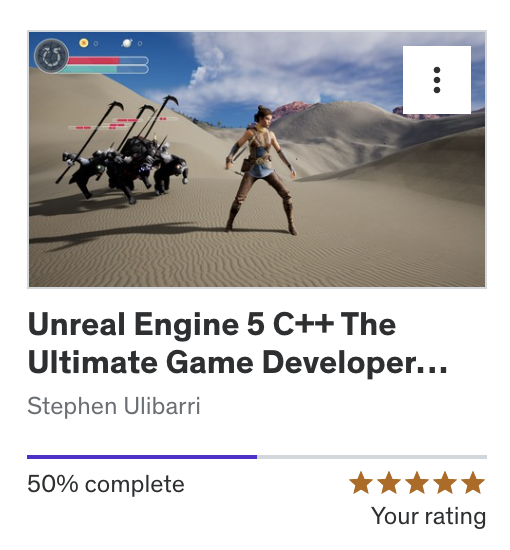

# Highlight of contributions to the game

I have been the leader of the team. I have been responsible for characters animations (Animation instance implementation), health bars, AI/NPC-s, combat and I have worked a little on the HUD. 

I have been doing a udemy course to help with programming this game. I have been working through *Unreal Engine 5 C++ The Ultimate Game Developer Course* by Stephen Ulibarri, to be exact. I have now completed 50 \% of the course. [The Ultimate Game Developer Course](https://www.udemy.com/course/unreal-engine-5-the-ultimate-game-developer-course/learn/lecture/33116840?start=720), see figure 1.

In Stephen's course, a lot of information about programming Unreal in C++ is covered, especially when it comes to animations. This is why it felt natural to apply myself in this way to this project.  In Unreal, it helps to be able to program to get the most out of the animation blueprints system as you can create your own animation instance implementation, and expose aspects of the internals of the game to the animation system. See the uml, UAnimInstance.

I implemented how Harker, the player character, strafes, runs, and can switch to crossbow. I implemented animation montages to let him swing his crossbow and fight enemies. I also implemented the animations for the enemies, which was a lot simpler. They can't strafe and mainly run, idle, attack and die. Attacking and dying is done with animation montages. Without Stephen's course, it would have been impossible for me to figure out how to make the characters animate inside Unreal. It was a pleasure doing Programming II, especially with the structure and help from the online course I did.

I have tried to implement everything covered in class. I believe I have implemented everything we have been shown except save and load to disk. I want to implement this for survival mode to let players save and see their high score.

Almost all the code is done in C++. Combat, animation instances, all sorts of stuff is done in C++ and it has been great fun.

# Self-reflection, what went well, what would you do differently.

I personally felt like this project went remarkably well without too much upset. There were many team members who were absent a lot, which is something I would like to somehow prevent in the future. I'm not sure what caused this. I was very stressed at the beginning of the project. I think the stress and worry propelled me into working quite hard and delivering something on par with the other groups.
